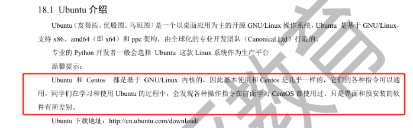
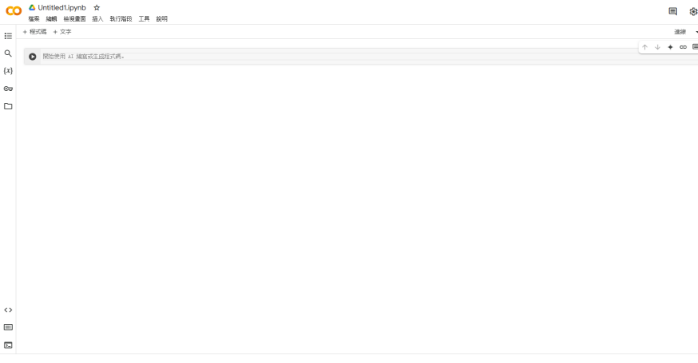

# 封面页
- 标题：**“生物信息学与分子生物学的探索与应用：自学报告”**
- 作者姓名: 李碧萱
- 学校/机构: 暨南大学
- 报告日期: 2025.1.18

# 目录
[封面页](#_toc188100832)

[目录](#_toc188100833)

[前言](#_toc188100834)

[摘要](#_toc188100835)

[R 和 PYTHON 在生物学中的应用](#_toc188100836)

[PYTHON 在生物学中的应用](#_toc188100837)

[R 在生物学中的应用](#_toc188100838)

[R 和 PYTHON 的对比](#_toc188100839)

[R 和 PYTHON 结合使用的例子](#_toc188100840)

[操作系统](#_toc188100841)

[Windows、CentOS、Ubuntu 和 WSL 的对比](#_toc188100842)

[Windows](#_toc188100843)

[CentOS](#_toc188100844)

[Ubuntu](#_toc188100845)

[WSL（Windows Subsystem for Linux）](#_toc188100846)

[总结](#_toc188100847)

[虚拟机技术与商业应用的全面解读](#_toc188100848)

[自用台式电脑硬件设备及单细胞分析能力](#_toc188100849)

[云算力概述：GOOGLE COLAB 及其硬件资源](#_toc188100850)

[GOOGLE COLAB 简介](#_toc188100851)

[1. CPU (中央处理器)](#_toc188100852)

[2. GPU (图形处理器)](#_toc188100853)

[GOOGLE COLAB GPU](#_toc188100854)

[TPU 适用场景：](#_toc188100855)

[COLAB PRO 和 COLAB PRO+](#_toc188100856)

[概念与比喻](#_toc188100857)

[DNA 就是“设计蓝图”](#_toc188100858)

[RNA 是“快递员”](#_toc188100859)

[单细胞分析是“拆开每个工厂检查”](#_toc188100860)

[双细胞去除是“清理混杂数据“](#_toc188100861)

[同源转化](#_toc188100862)

[任务与方法](#_toc188100863)

[参考来源](#_toc188100864)

# 前言
清晰的概念、目的和用途是生物科研中的核心要素。 作为一个对生物科研充满热情的人，我深刻认识到，不同的人对生物科研的理解和追求可能各有不同。因此，在当前学期末，面对繁忙的考试和其他工作压力时，我没有专注于技术实践或编程任务，而是选择借此机会重新梳理和理清生物科研的核心概念与目标。

通过这次思考和重组，我希望能够巩固核心思想，明确每个科研步骤的科学规范，为未来的学习和研究奠定更加扎实的基础。回顾过去，我发现自己在科研过程中过于盲目地追求技术或技能，而忽视了对生物科研核心目的和方法的深入理解。相比单纯积累技术，这种以概念为导向的学习方式，能够帮助我在实际科研中更好地解决问题，提高效率。

同时，我意识到，虽然技术无疑是实现科研目标的工具，但它应当服务于明确的科研目标，而不是成为唯一的追求。深入理解生物科研的核心目的和方法，不仅帮助我在未来的学习中避免盲目跟风，还能确保我的研究始终与实际问题紧密对接。通过这种思考，我能够在复杂的技术应用中保持方向感，保证每一步的研究都朝着解决实际问题的方向发展。

这篇文案是我个人的理解和概念，可能会有错漏或不规范之处，若发现任何错误或更好的补充，请各位不吝赐教。
# 摘要
**用通俗概念理解生物数据分析**

**1. 编程、云算力与不同系统上的运作：结合 R、Python 和高性能计算，解决生物学数据的复杂性和计算瓶颈[1]**

- **编程与云算力**：使用 R、Python 等编程语言和云计算资源，处理复杂的生物数据。云计算提供弹性计算能力，解决大数据分析中的瓶颈问题。
- **操作系统**：
  - **Windows**：适合小规模数据分析，易于操作。
  - **Linux**：更稳定高效，广泛用于科研领域，适合大规模数据处理。

**2. DNA 和 RNA：遗传信息的核心载体，分别负责基因信息的储存和表达[4][5]**

- **DNA**：储存遗传信息，类似生命的建筑蓝图。
- **RNA**：从DNA中提取信息并传递给细胞，指导蛋白质合成。

**3. 单细胞分析与双细胞去除：用于揭示细胞异质性并优化数据质量[3]**

- **单细胞分析**：揭示每个细胞的功能和异质性。
- **双细胞去除**：去除冗余数据，优化分析准确性。

**4. 同源转化：基于同源重组的基因编辑技术，广泛应用于功能基因研究和疾病治疗[2]**

同源转化技术通过精准修改基因，广泛应用于基因功能研究、疾病治疗和遗传性疾病修复。
# R 和 PYTHON 在生物学中的应用
Python 和 R 是生物学中最常用的编程语言，广泛应用于基因组学、转录组学、数据分析和可视化等领域。两者各有优势，适用于不同类型的生物数据分析任务。[6]
## PYTHON 在生物学中的应用
- 基因组学与转录组学：通过 biopython 处理DNA序列，使用 pandas 和 numpy 进行数据整理和分析。[7]
- 数据分析与机器学习：使用 scikit-learn 进行模式识别，支持大数据分析。[9]
- 生物信息学工具：如 BioPython 用于DNA序列比对和基因组注释。[8]
## R 在生物学中的应用
- 统计分析与模型构建：用于RNA-Seq分析、差异表达分析（如 DESeq2）。[10]
- 数据可视化：通过 ggplot2 创建高质量的图表。[11]
- 高通量数据分析：处理RNA-Seq、ChIP-Seq等大规模数据。[12]
## R 和 PYTHON 的对比

|特性|Python|R|
| :-: | :-: | :-: |
|**易用性**|简单易学，适合初学者|强大统计支持，但较为复杂|
|**数据处理**|pandas 和 numpy 适合大数据处理|data.table 和 dplyr 高效处理数据|
|**可视化**|matplotlib、seaborn 提供灵活的可视化|ggplot2 强大生物数据可视化功能|
|**生物学专用库**|BioPython 等生物信息学库|Bioconductor 提供生物学专用工具|
|**统计分析能力**|scipy、statsmodels 提供统计功能|强大统计建模能力，适用于生物统计分析|

结论

- Python 适合大数据处理、机器学习和流式数据分析。[13][14]
- R 强大的统计分析和可视化能力，多应用于基因组学和转录组学。[15]

Python 和 R 可以互补使用，共同处理复杂的生物数据分析任务。
## R 和 PYTHON 结合使用的例子
以下是 **R 和 Python 结合使用的例子**，突出各自的优点，并展示相对于单独使用一种语言的优势。

例子：RNA-Seq 数据分析

在 RNA-Seq 数据分析中，我们通常涉及到以下几个步骤：

1. 数据预处理与清理
1. 差异表达分析
1. 可视化结果

**1. 数据预处理与清理：使用 Python[17]**

- **优势**：Python 在数据处理、清理和转换方面非常高效，尤其是对于处理大规模数据时，pandas 和 numpy 提供了高效的数据结构和计算方法。Python 可以方便地对数据进行过滤、缺失值处理、标准化等操作。在RNA-Seq数据分析中，通常我们需要从原始数据中剔除低质量样本或基因、对数据进行归一化或标准化等处理。

**常用函数**：

- pandas.DataFrame.dropna()：用于删除包含缺失数据的行或列。
- pandas.DataFrame.apply()：用于对数据应用函数进行批量处理。
- numpy.std() 和 numpy.mean()：分别用于计算标准差和均值，便于标准化数据。

通过 Python，分析师能够高效地进行数据清理和初步处理，为后续的分析步骤打下基础。

**2. 差异表达分析：使用 R[16]**

- **优势**：R 是生物统计分析领域的主力语言，尤其擅长进行RNA-Seq等数据的差异表达分析。R 提供了大量专门为生物数据设计的统计方法和包。例如，DESeq2 是 RNA-Seq 分析中最常用的差异表达分析包之一，能够基于统计模型评估不同条件下基因的表达差异。通过 DESeq2，我们可以快速判断某些基因在实验组和对照组之间的表达差异是否显着。

**常用函数**：

- DESeqDataSetFromMatrix()：从原始计数矩阵和条件数据中创建 DESeq2 数据集。
- DESeq()：执行差异表达分析，返回分析结果。
- results()：提取分析结果，并计算基因表达的fold change和P值。

R 提供了专为基因表达数据设计的工具，使得进行差异表达分析时，不需要从头编写复杂的统计模型，分析过程更加简便且高效。

**3. 可视化：使用 Python 和 R 结合[18]**

- **优势**：Python 和 R 都具备强大的可视化功能，但各自的优点和侧重点有所不同。Python 的 matplotlib 和 seaborn 库擅长制作科学图表，适合数据的多维度可视化，尤其是在处理热图、散点图等类型的数据时，seaborn 提供了更直观、易于调整的可视化方法。而 R 的 ggplot2 提供了更加灵活和复杂的绘图功能，特别适合绘制生物学研究中常见的图形，如火山图和MA图等。

**Python的可视化优势**：

- seaborn.heatmap()：适合用于绘制RNA-Seq数据的热图，可以非常方便地展示基因表达数据的模式。
- matplotlib.pyplot.scatter()：适用于绘制差异表达分析中的散点图，展示不同基因的表达情况。

**R的可视化优势**：

- ggplot2：可以绘制灵活的火山图或MA图，便于展示RNA-Seq差异表达分析的结果。火山图通过横轴展示基因的fold change，纵轴展示统计显着性，帮助研究者快速识别出重要基因。

**总结：**

- **Python** 在数据处理、清理和转换方面表现出色，尤其适合大数据量的操作。对于RNA-Seq数据分析中的初步数据处理步骤（如去除低质量样本、数据标准化等），Python 是非常合适的工具。
- **R** 在统计分析和数据可视化方面具有无可比拟的优势。使用 R 进行差异表达分析，可以快速评估基因表达差异的统计显着性，并借助 R 强大的绘图功能，轻松生成高质量的统计图表。
- **结合使用**：Python 和 R 结合使用能够发挥各自的优势，Python 处理大数据和数据清洗的效率高，而 R 在进行差异表达分析和高级统计分析时非常强大。可视化环节，两者结合可以充分发挥各自的优势，生成多样化且高质量的分析图表。

**相较于单一使用一种语言的优势[19]：**

- **单独使用 Python**：Python 的数据处理能力强，但在进行统计分析和复杂可视化时不如 R 高效，可能需要编写额外的统计模型。
- **单独使用 R**：R 在生物统计和绘图方面表现卓越，但对于大规模数据的处理和清理速度相对较慢，可能会遇到内存或性能瓶颈。

因此，结合使用 Python 和 R 可以使数据处理、分析和可视化的各个环节更加高效，整体分析流程更加顺畅。
# 操作系统
**R 和 Python 在不同操作系统上的应用**

R 和 Python 是广泛应用于生物学、数据科学和机器学习领域的编程语言。其最大的优势之一就是跨平台支持，即它们可以在不同操作系统上运行，无论是 Windows、CentOS、Ubuntu 还是 WSL（Windows Subsystem for Linux），都可以通过相同的代码实现功能。

- **R：**
  - **RStudio Server**：RStudio 是最流行的 R 集成开发环境（IDE），而 RStudio Server 使得用户能够通过 Web 浏览器访问 R 环境。无论是在 Windows、CentOS、Ubuntu 还是通过 WSL，只要安装了 RStudio Server，用户都可以通过浏览器连接并执行相同的分析任务，界面和操作几乎没有差异，确保了平台之间的一致性。
- **Python：**
  - **跨平台兼容性**：Python 本身也是跨平台的，能够在 Windows、CentOS、Ubuntu 和 WSL 上运行。通过 Anaconda 或 virtualenv 等工具，Python 环境可以在各平台上快速配置，确保相同的包和依赖环境，从而避免不同操作系统之间的兼容问题。

因此，R 和 Python 在不同操作系统中的使用非常一致，能够使生物学研究人员在不同平台间灵活切换，且无需过多考虑环境配置问题。
## WINDOWS、CENTOS、UBUNTU 和 WSL 的对比
**表格：Windows、CentOS、Ubuntu 和 WSL 的优势与劣势[21][22][23]**

|**特性/系统**|**Windows**|**CentOS**|**Ubuntu**|**WSL**|
| :-: | :-: | :-: | :-: | :-: |
|**易用性**|最易于上手，适合初学者|配置略复杂，需要一定的技术背景|适中，拥有易于使用的图形界面|结合Windows易用性，适合需要Linux功能的用户|
|**软件支持**|支持大量商业软件，兼容性好|支持许多开源工具，适合服务器和科研计算|支持所有主流的开源软件，有广泛的社区支持|支持大多数Linux软件，部分Windows软件也可通过桥接使用|
|**性能**|对比Linux性能较弱，尤其是大数据处理|优化好，适合高效数据分析和并行计算|性能较好，适合大数据处理，特别是云环境|性能接近原生Linux，但有轻微开销|
|**命令行支持**|命令行支持不如Linux强大|强大的命令行工具，适合批量操作与自动化|拥有强大的命令行支持，适合开发和数据分析|基于Linux的Bash，命令行功能强大|
|**包管理**|使用Windows特有的包管理工具|使用YUM（类似apt）管理软件包|使用APT包管理系统，支持广泛的软件包|使用APT包管理系统，兼容Ubuntu的软件包|
|**社区支持与文档**|社区支持丰富，但开源工具有限|丰富的开源支持，特别是在服务器和科学计算领域|具有广泛的社区支持，用户文档完备|利用Linux社区资源，结合Windows社区支持|
|**更新与安全性**|需购买许可，定期更新|长期支持，但CentOS 8已停止维护|持续更新，适合企业和科研环境|与Windows同步更新，依赖Microsoft的支持|
|**适用场景**|家庭办公、科研初学者、商业软件运行|科研机构、服务器、长期稳定的工作负载|开发、科学计算、数据分析、云平台|需要在Windows环境中使用Linux工具和环境的用户|
## WINDOWS
- **优势：**
  - **用户友好**：Windows 系统的图形界面非常友好，操作简单，适合没有编程背景的生物学家和科研人员。
  - **软件支持**：Windows 支持大量的商业软件，如 Microsoft Office 和许多专业的生物学分析软件（如 Geneious、ImageJ、EndNote 等），这些软件具有强大的 GUI 支持和易用性。
  - **R 和 Python 的支持**：R 和 Python 都能在 Windows 上运行，虽然命令行不如 Linux 高效，但对于小型数据集和日常使用已经足够。
- **劣势：**
  - **性能瓶颈**：Windows 在处理大数据时，尤其是并行计算和多任务处理方面不如 Linux 强大。在处理复杂的生物学数据时，尤其是基因组学和转录组学分析，Windows 显得力不从心。
  - **命令行操作差**：虽然 PowerShell 和 WSL（Windows Subsystem for Linux）有所改进，但命令行工具和 Linux 环境下的 Bash 相比，功能和性能都有差距。
## CENTOS
- **优势：**
  - **高效稳定**：CentOS 是 RHEL 的免费开源版本，广泛应用于科研机构、企业和服务器环境。它在性能和稳定性上表现非常优越，适合需要长时间运行的科研计算任务。
  - **适合服务器部署**：CentOS 是服务器级操作系统，适合运行大规模数据分析任务，特别是在基因组学、蛋白质组学等生物数据分析中，具有显着的优势。
  - **支持 R 和 Python 工具链**：CentOS 与 Linux 其他发行版一样，支持 R 和 Python 的各种分析工具和包，如 Bioconductor、Biopython、Galaxy 等。
- **劣势：**
  - **停止维护**：CentOS 8 已于 2021 年底停止维护，这意味着不能再获得安全更新和技术支持，这对长期依赖 CentOS 的科研机构和企业来说是一个大问题。
  - **迁移问题**：许多用户需要迁移到 Rocky Linux 或 AlmaLinux，这些系统由社区成员开发，旨在延续 CentOS 的稳定性和兼容性。
## UBUNTU
- **优势：**
  - **广泛应用**：Ubuntu 是世界上最流行的 Linux 发行版之一，特别适用于科研人员和开发者。它不仅支持大多数生物学工具，而且与其他 Linux 系统兼容。
  - **强大的社区支持**：Ubuntu 拥有庞大的社区，用户可以获得丰富的文档支持和技术帮助，这对于没有太多 Linux 使用经验的科研人员来说非常有帮助。
  - **更新与维护**：Ubuntu 提供定期更新，支持长期版本（LTS）使得企业和科研机构可以获得多年的稳定支持。
  - **适合云计算与虚拟化**：在云计算平台上，Ubuntu 是一个非常受欢迎的选择，适合需要快速部署和自动化的科研环境。
- **劣势：**
  - **性能略逊**：尽管 Ubuntu 在性能方面比 Windows 强，但在某些高效数据处理和高负载任务上，CentOS 可能会更优。
  - **依赖较重**：Ubuntu 一些高级特性和图形界面可能需要更多的资源，相比 CentOS 更消耗系统性能。
## WSL（WINDOWS SUBSYSTEM FOR LINUX）
- **优势：**
  - **无缝集成**：WSL 允许在 Windows 上运行原生 Linux 二进制文件，无需设置虚拟机或双启动系统，提供了便利的跨平台开发环境。
  - **轻量级**：相比传统的虚拟机，WSL 占用的资源更少，启动速度更快，适合日常的开发和练习任务。
  - **访问Windows资源**：WSL 可以直接访问 Windows 文件系统和应用程序，方便在同一环境中使用Windows和Linux工具。
  - **支持多种Linux发行版**：用户可以选择安装多种Linux发行版（如Ubuntu、Debian、Fedora等），根据需求灵活切换。
  - **持续更新**：WSL 2 引入了真实的Linux内核，提升了兼容性和性能，并且Microsoft持续为其提供更新和优化。
- **劣势：**
  - **性能开销**：尽管WSL 2的性能接近原生Linux，但仍有轻微的性能开销，尤其是在I/O密集型任务中。
  - **有限的GPU支持**：WSL 2 开始支持GPU加速，但功能和性能可能仍不如原生Linux环境，尤其是在需要高显存和强大并行计算能力的任务中。
  - **网络和系统调用限制**：某些Linux应用和网络功能在WSL中可能存在限制或不完全支持，影响特定分析工具的使用。
  - **资源分配**：WSL共享Windows的系统资源，可能在高负载时导致资源竞争，影响分析任务的稳定性和效率。
## 总结
- **Windows** 适合初学者和需要GUI支持的用户，但在生物数据分析中性能相对较弱。
- **CentOS** 曾是最稳定和可靠的选择，尤其适合服务器和大数据分析，但由于停止维护，推荐迁移至 Rocky Linux 或 AlmaLinux。
- **Ubuntu** 提供强大的社区支持，更新及时，适合科研和开发环境，尤其适合云计算和虚拟化。
- **WSL** 结合了Windows的易用性和Linux的强大功能，适合需要在Windows环境中使用Linux工具的用户，适合日常的开发和中小规模分析，但在处理超大规模数据和高性能需求时仍不如原生Linux或学校服务器。

所有 linux 的相似度高达9成以上, 就像用小米手機和三星手机的区别。

linux 都有自己的图形化操作介面, 但一般服務器为了節省资源开銷, 都是用终端机指令操作。

对于大多数生物学分析，CentOS（或其替代品 Rocky Linux）、Ubuntu 和 WSL 都是合适的选择。CentOS 和 Ubuntu 提供了良好的性能、稳定性和高效的数据分析工具支持，适合服务器和大规模数据分析任务。而 WSL 则适合在Windows环境中进行开发和中小规模的分析，提供了便利的跨平台使用体验。
# 虚拟机技术与商业应用的全面解读
**虛擬機器 (VM)：技術本質與商業應用** 

VM（虛擬機器） 是一種通過抽象化將實體硬體資源轉換為多個獨立虛擬環境的技術。這些虛擬環境每個都能像獨立的物理計算機一樣運行自己的操作系統、應用程式及檔案系統，儘管它們實際上共用同一台物理機器的硬體資源。 

1. **VM 的核心概念與優勢** 

**資源抽象化與共享** 

VM 使得一台實體機可以運行多個虛擬環境。每個虛擬機都有自己的處理器、內存、存儲及網絡資源，這些資源來自於底層的物理硬體，但每個 VM 看起來就像一台完全獨立的計算機。 

**主要優勢：** 

- 資源利用率提升：多個 VM 可以共享物理硬體資源，最大化硬體使用效率。 
- 靈活性與可擴展性：VM 可以快速建立、複製、調整配置或移動，靈活應對需求變化。 
- 隔離性：不同 VM 之間完全隔離，故障或安全問題不會互相影響，提升穩定性與安全性。 
- 多樣性：能在同一台實體機上運行不同的操作系統（如 Windows、Linux、macOS），滿足不同的應用需求。 
1. **VMware 只是其中的一種實現方式** 

許多人誤以為 VM 就是 VMware。事實上，VM 只是虛擬化技術的核心概念，而 VMware 只是其中的一個商業實現方式。VMware 提供的虛擬化軟體（如 VMware Workstation 和 VMware vSphere）是建立和管理 VM 的工具之一。 

- 其他虛擬化平台： 
- VirtualBox：開源、免費，適合學習和個人使用。 
- Hyper-V：微軟自帶的虛擬化工具，支援 Windows 和 Linux 系統。 
- Parallels：特別針對 Mac 平台，提供優質的虛擬化體驗。 
1. **雲端服務商的 VM 服務** 

現今許多雲端服務供應商也提供 VM 服務，允許使用者在線上租用虛擬化資源。這些服務通常具有高度的可擴展性和彈性，並且可以隨時調整配置和數量。 

知名雲端服務商的 VM 服務： 

Google Cloud Platform (GCP)：提供 Compute Engine，讓使用者根據需求選擇 CPU、內存、存儲空間等配置，並支持快速應用部署。[23] 

Amazon Web Services (AWS)：提供 EC2（Elastic Compute Cloud），提供廣泛的實例類型選擇，支援自動擴展和負載平衡等功能。[25] 

Microsoft Azure：提供 Virtual Machines，支持不同操作系統的虛擬化部署，並且提供自動擴展和負載均衡等高可用功能。[24] 

1. **VM 應用場景：從學習到高效能計算** 

VM 的應用範圍遠不止於學習用途。虛擬化技術在不同層級的運算環境中扮演著重要角色： 

- 入門級：學習與開發（如 2-4 核 CPU，4-8 GB RAM）。 
- 企業級：生產環境（如 16-64 核 CPU，64-256 GB RAM）。 
- 高效能運算：AI 訓練（如搭配 NVIDIA H100 GPU）、大數據分析（如 128 核 CPU）、記憶體密集應用（如 1TB 以上 RAM）。 
1. **VM 的核心商業價值：隔離與資源管理** 

VM 在商業應用中最具價值的是 資源隔離與管理。不僅限於創建多個操作系統環境，它還能精確管理計算資源，從而提升系統的安全性與可管理性。 

**主要商業應用：** 

- 虛擬專用伺服器（VPS）：提供獨立虛擬環境，客戶可獨立控制系統與資源。 
- 應用隔離：將不同的業務系統分開運行，增強安全性。 
- 資源配置：精確分配計算資源，優化成本與效能。 

**商業應用場景：** 

- 企業內部系統隔離 
- 雲端服務提供商（VPS/雲端主機） 
- 開發與測試環境 
- 高效能運算集群 
- 多租戶服務架構 
1. **本地與商業 VM 的區別** 

**本地 VM（如 VMware Workstation）：** 

- 主要用於系統測試、開發與學習。 
- 適合個人用戶，對於多系統操作與配置進行學習。 

**商業 VM：** 

- 注重效能、穩定性與資源隔離。 
- 提供高可用性、支援自動化管理及 SLA 保證。 
- 適合高負載、長期運行的生產環境。 

**總結** 

VM 是一項重要的虛擬化技術，它通過抽象化底層硬體資源，提升了系統資源的利用效率、靈活性和可擴展性。VMware 是虛擬化的商業實現之一，但 VM 技術遠不限於此，並在許多雲端服務中得到了廣泛應用。
# 自用台式电脑硬件设备及单细胞分析能力
**我的设备：适合练习，真正分析需依赖学校服务器**

我的台式电脑具备一定的硬件能力，可以支撑中小规模的单细胞分析任务，但与学校服务器相比，性能仍有较大差距。尽管在虚拟机中运行Linux系统可以完成练习任务，但在实际的大型数据分析中，学校服务器无疑是更好的选择。

**台式电脑硬件配置与能力**

经运之前我运行代码和压力测试评估

- **处理器 (CPU)：Intel Xeon E5-2667 v4**
  - 特点：8核16线程，主频3.5GHz，适合单任务和轻度并行计算。
  - 局限：核心数量少，处理高并行任务或超大规模数据时效率不足。
- **内存 (RAM)：32 GB DDR4 SDRAM**
  - 特点：可支持处理10,000 - 30,000个细胞和1,000 - 5,000个基因的小型数据集。
  - 局限：面对超大规模数据（如100,000+细胞）可能因内存不足导致性能下降。
- **显卡 (GPU)：NVIDIA GeForce RTX 2080 SUPER**
  - 特点：8 GB显存，支持深度学习加速工具（如CellBender）。
  - 局限：显存较低，难以处理多模态或超大规模任务。
- **存储：1 TB NVMe SSD**
  - 型号：ZHITAI TiPIuS5000 1TB，状态良好（SMART状态：OK）。
  - 特点：高速NVMe存储支持快速数据读写，可满足单细胞分析对存储性能的需求。
  - 局限：尽管容量充足，仍然不适合长期存储大型项目数据或运行超大规模数据集。

**学校服务器硬件优势**

按合理推测评估

- **处理器 (CPU)：双Intel Xeon E5-2683 v3**
  - 特点：28核56线程，核心数量远超台式机，适合高并行计算。
  - 局限：主频2.0GHz，在单线程任务中效率稍逊。
- **内存 (RAM)：512 GB ECC内存**
  - 特点：支持超大规模数据集处理，适合超过100,000个细胞的数据分析。
  - 对比：台式机32 GB内存无法应对同等规模的数据。
- **存储：1 TB SSD + 18 TB HDD**
  - 特点：超大存储空间支持大规模项目长期管理，远超台式机容量。
- **GPU：无**
  - 局限：缺乏GPU支持，无法运行需加速的深度学习工具。

**在Windows上运行Linux虚拟机**

为了在我的台式电脑上进行单细胞分析练习，我在Windows系统中安装并运行了Linux虚拟机。合理分配资源给虚拟机可以确保在进行数据分析时，虚拟机拥有足够的计算能力，同时不影响Windows系统的正常运行。

**资源分配：**

- CPU：分配4核（8线程）给Linux虚拟机，剩余4核（8线程）留给Windows系统。
- 内存：分配16 GB RAM给Linux虚拟机，剩余16 GB RAM供Windows系统使用。
- 显卡：显卡资源主要由Windows系统管理，虚拟机可通过虚拟化技术部分利用GPU资源，但实际性能提升有限。

**我电脑经可处理任务**

我电脑经运行代码和压力测试

  - 单细胞数量：10,000 - 30,000。
  - 基因数量：1,000 - 5,000。
  - 适合任务：降维（t-SNE、UMAP）、聚类、差异表达分析、小型深度学习任务。
  - 局限：大数据集和复杂任务效率低。

**总结**

我的台式电脑在合理分配资源给Linux虚拟机后，依然能够支持中等规模的单细胞RNA测序分析，适合日常的学习和练习。然而，面对更大规模的数据分析任务（如超过50,000个细胞或更高维度的基因数据），学校的服务器凭借其更强大的处理能力和更大容量的内存，将是更理想的选择。因此，在进行真正的大规模分析时，依托学校服务器资源，以确保分析的高效性和准确性。学校服务器在多核CPU、内存和存储上的显著优势，因此在大型的分析，学校的服务器是更可靠的选择，而我的设备则主要适用于日常实验练习和中小规模的数据分析任务。
# 云算力概述：GOOGLE COLAB 及其硬件资源
云计算（Cloud Computing）是一种通过互联网提供计算资源和服务的方式，使得用户无需拥有强大的本地硬件即可进行高效计算。Google Colab 是一种广受欢迎的云计算服务，特别适合用于机器学习和生物数据分析等任务。它基于 Google 的基础设施，提供免费的计算资源，并支持各种编程语言（如 Python 和 R）以及多个强大的硬件加速器（如 GPU 和 TPU）。[25]
## GOOGLE COLAB 简介
Google Colab 是 Google 提供的动态硬件分配平台，用户在使用时并没有固定的硬件资源。付费用户（如 Colab Pro 和 Colab Pro+）会获得更高的分配优先级和更多的计算资源。

需要注意的是，Google Colab 不适合长时间运行（如连续几天的任务），因为会定期断开连接。一旦 Colab 会话关闭，环境会被重置。启动新的 Colab 会话类似于全新安装的 Linux 系统，不过它预装了许多常用的工具和库，便于快速上手。

租用云算力的特点是“即用即弃”，因此用户需要自行保存计算结果，避免会话结束后数据丢失的问题。

Google Colab 是 Google 提供的一种基于 Jupyter Notebooks 的交互式编程环境，用户可以在其中运行 Python 代码，尤其适用于深度学习、数据分析和科学计算等任务。它的特点包括：

免费使用：Google 提供了免费账户，可以享受一定的计算资源（如 GPU 和 TPU）。

无缝集成 Google Drive：用户可以直接将文件保存在 Google Drive 中并与 Colab 连接，便于访问和管理文件。

基于浏览器：Colab 是一个云端工具，用户无需安装任何软件，直接通过浏览器即可使用。

Google Colab 中的硬件资源：CPU、GPU 和 TPU

## 1. CPU (中央处理器)
CPU 是计算机的核心处理器，负责执行程序指令。Google Colab 提供的免费 CPU 资源通常是现代的多核处理器，足够处理大部分基础计算任务，但对于一些计算量较大的任务（如大规模数据分析或深度学习训练），CPU 的计算能力可能显得不足。

CPU 适用场景：数据预处理、简单的数学运算、文件读写、统计分析等。

限制：对于复杂的深度学习任务，使用 CPU 进行训练可能非常慢，尤其是在数据量大或模型复杂的情况下。
## 2. GPU (图形处理器)
GPU 是专门为处理图形和图像渲染任务设计的处理器，但由于其高并行计算能力，它也非常适合用于深度学习和大规模矩阵计算。在 Google Colab 中，用户可以免费获得低配的GPU，这些都是高性能的图形处理器，专为机器学习和深度学习任务设计。

GPU 适用场景：

深度学习训练：神经网络的训练和推理任务通常需要强大的 GPU 支持，尤其是卷积神经网络（CNN）和循环神经网络（RNN）。

高效的数据处理：如图像处理、视频分析、基因组数据分析等任务。

并行计算：GPU 的多核结构使得它能在短时间内处理大量数据，适合需要大量计算的任务。
## GOOGLE COLAB GPU：

3\. TPU (张量处理单元)

TPU 是 Google 开发的专门用于机器学习任务的加速器，特别适合深度学习训练。与 GPU 类似，TPU 的架构也非常适合大规模并行计算，但 TPU 在优化张量运算（特别是深度学习中的矩阵计算）方面有着比传统 GPU 更高的性能。
## TPU 适用场景：
深度学习模型训练：尤其是 TensorFlow 框架中使用的深度学习模型，TPU 提供了显着的性能提升。

大规模数据并行计算：TPU 能在极短的时间内进行大规模计算，适合需要快速模型训练和大数据处理的场景。

强化学习和大规模神经网络训练：对于需要快速推理和反馈的任务，TPU 是一个理想的选择。

Google Colab TPU：

Colab 免费版提供的 TPU 资源与 GPU 类似，可以加速训练大型神经网络，特别是当使用 TensorFlow 时，TPU 能提供极大的性能提升。

TPU 适合训练大型模型，特别是需要大量数据并且计算量巨大的应用，如自然语言处理（NLP）和图像生成。

Google Colab 的硬件资源选择与限制

免费版的限制：

免费版提供的 GPU 和 TPU 的性能通常较为基础，适合开发和小规模模型训练。如果需要更多算力和更高性能的资源，可以选择 Colab Pro 付费版。
## COLAB PRO 和 COLAB PRO+：
Colab Pro 提供更多的计算资源、更长时间的运行支持以及更高效的硬件，适合需要大量算力的深度学习任务。

Colab Pro+ 是更高端的付费版本，提供更多的资源、延长的计算时间以及更强的硬件支持。

**总结**

Google Colab 为生物学研究人员和数据科学家提供了便捷且强大的云计算资源，尤其是在 深度学习 和 大数据分析 中发挥了重要作用。

CPU 适合简单任务和小型分析，GPU 非常适合需要并行计算的任务，如深度学习训练，而 TPU 是优化深度学习算法的最佳选择，特别是在使用 TensorFlow 时。

通过 Google Colab，用户可以免费访问强大的算力（尽管有使用限制），而付费版（Colab Pro 和 Pro+）则提供更多的资源和更长的使用时间，适合需要大规模计算的任务。

# 概念与比喻
## DNA 就是“设计蓝图”

想象你要建造一栋大楼，首先需要一份详细的“设计蓝图”。这个蓝图里包含了大楼的每一个细节：从外观形状到每一层的功能布局，以及每一根支柱和每一堵墙的具体位置。这份蓝图是整个建筑工程的核心，它指导着工人们如何按照要求建设这栋大楼。

在生物学中，DNA 就是细胞的“设计蓝图”。它包含了一个生命体的所有基本信息，就像大楼蓝图一样，DNA 指导着细胞如何生长、发育、分裂，并决定了每个生命体的特征，比如眼睛的颜色、身高，甚至是否容易得某些疾病。通过分析 DNA，科学家可以发现许多关于我们健康、遗传和身体特征的秘密。

**生物实例：**

每个人的DNA都可以看作是一份独一无二的“设计蓝图”。例如，人的眼睛颜色是由特定的基因决定的，这些基因就像设计蓝图中的“颜色标注”，指导细胞如何合成眼睛的色素。如果一个人的 DNA 中有一个关于眼睛颜色的特定“代码”，它会告诉细胞产生蓝色、棕色或者绿色的眼睛色素。

同样，DNA 也包含了有关疾病的“设计信息”。比如，有些人因为特定基因的改变，可能容易患上某些遗传病，如囊性纤维化或地中海贫血。这些基因就像设计蓝图中的“警告标志”，提醒细胞它们需要特别注意和处理某些问题。

另一个例子是 DNA 和遗传：父母会将部分 DNA 传递给子女，这就像是传递一份“蓝图”一样。例如，如果父母中的一个有蓝眼睛基因，那么他们的孩子就有可能拥有蓝眼睛。

**总结：**

DNA 就像是细胞和生命体的“设计蓝图”，它包含了所有指导身体运作、成长和特征的详细信息。通过分析 DNA，科学家能够揭示个体的遗传密码，理解疾病的风险，以及生命如何在微观层面上运作。正如建筑物的设计蓝图指导建筑的构建，DNA 也指导着生命的构建与发展。
## RNA 是“快递员”
想象你正在建设一座新工厂，这个工厂有一个非常详细的“建筑蓝图”，但工厂本身不能直接使用这些蓝图来建造生产线或设备。工厂需要一名“快递员”，把这个蓝图从仓库（存储位置）带到建筑工地，告诉工人们如何构建每一个细节。这个“快递员”不仅要准确地传送蓝图，还要确保工人能够按照蓝图上的设计来建造工厂。

在细胞中，DNA 就像是这些“建筑蓝图”，它包含了细胞要做所有事情的详细信息，比如生产哪些蛋白质。RNA 就是那个“快递员”，它负责把 DNA 中的“信息”提取出来，并将其传送到细胞内的蛋白质制造工厂（即 ribosome，核糖体）。这些“快递员”确保每个细胞按需生产蛋白质。

**生物实例：**

比如说，在人体内，某些细胞需要生产胰岛素，这是一种帮助调节血糖的蛋白质。胰岛素的“制造蓝图”存储在 DNA 中。当身体需要产生胰岛素时，RNA 会从 DNA 中提取出这一蓝图的信息，并把它传递给负责蛋白质合成的工厂——核糖体。核糖体根据 RNA 提供的“指令”，开始合成胰岛素。整个过程就像快递员从仓库拿到订单，送到工地，确保工人们根据蓝图建造出需要的设备。

而且，在RNA的帮助下，细胞可以根据身体的需要快速而准确地调整生产。例如，当血糖过高时，RNA会帮助胰岛细胞快速合成更多的胰岛素。没有RNA的“快递员”，细胞将无法从DNA获取所需的信息，导致蛋白质合成不畅，影响细胞的正常运作。

**总结：**

RNA作为“快递员”在细胞中的作用至关重要，它把DNA中的遗传信息传送到细胞工厂，为细胞提供生产所需的指令，就像一名快递员确保工厂能准确地收到蓝图，从而完成工厂的建设或生产任务。
## 单细胞分析是“拆开每个工厂检查”
假设你拥有一个巨大的工业园区，这个园区里有成百上千个不同的工厂，每个工厂都有自己独特的职责，比如有些工厂负责清洁，有些工厂负责生产，还有的工厂负责包装。整个工业园区运作时，每个工厂都在同时工作，互相协作，最终生产出各种产品。

但你并不只关心整个园区的产量或者园区的整体健康，你希望了解每一个工厂的具体情况，看看它是不是正常工作，是否出现了故障，或者有些工厂是否可能不再运作了。为此，你决定一个一个地拆开每个工厂，仔细检查它们的生产线、设备、人员和运作状态，这就是“单独检查每个工厂”。

在生物学中，单细胞分析的概念就像是你拆开每个工厂一样，它允许科学家在细胞水平上研究生物体中的每一个细胞，而不是只关注整个组织或器官的健康。每个细胞都像是一个独立的工厂，负责不同的工作任务。通过单细胞分析，我们能够揭示每个细胞的基因表达情况，了解它们的功能、健康状况和是否发生了变化。

**生物实例：**

假设你正在进行一项关于肿瘤的研究，目标是分析肿瘤内的不同细胞类型。肿瘤不仅仅由一种类型的细胞组成，实际上，它由许多不同类型的细胞组成，每个细胞可能有不同的功能。比如，肿瘤细胞可能分裂很快，但也有一些免疫细胞会进入肿瘤区，试图对抗癌症。传统的方法可能只能提供肿瘤的整体信息，如肿瘤大小、形态和癌症的扩散情况，但我们无法知道每个细胞具体的情况。

通过单细胞分析，科学家能够对肿瘤中的每个细胞进行单独的研究，了解每个细胞的基因表达信息。比如，有些肿瘤细胞可能已经发生了变异，变得更加侵袭性，而其他细胞可能是处于休眠状态。这种详细的信息是通过传统的“总体分析”无法获得的。

这种单独检查每个细胞的方式，帮助科学家更好地了解癌症的具体进程，从而制定更加精准的治疗方案，类似于你单独检查每个工厂的生产线，发现某个工厂出现问题，从而采取相应的修复措施。
## 双细胞去除是“清理混杂数据“
**双细胞去除：清理混杂数据** 双细胞（Doublets）是指在单细胞RNA测序（scRNA-seq）实验中，由于技术或操作问题，两个独立的细胞被误捕到同一个微滴中进行测序，从而生成一个“伪细胞”的基因表达数据。其结果是，这两个细胞的基因表达谱被合并，形成了异常的混合信号。这种混杂信号可能导致数据分析中的偏差，例如虚假的细胞亚群、错误的细胞比例估算，甚至对关键基因的功能推断造成干扰。

**形成原因**

1. **细胞浓度过高**：细胞悬液浓度过高时，单个微滴可能同时捕获多个细胞，增加双细胞发生的概率。实验中，目标细胞数与微滴捕获数量的不匹配可能是双细胞生成的主要原因。
1. **设备限制**：微滴生成设备的分辨率有限，可能无法完全避免两个细胞同时进入同一捕获单元。
1. **操作误差**：细胞样本混合不均或实验流程中的其他技术失误（例如液体处理过程中的气泡、震动等）也会导致双细胞的形成。

**特征**

- **基因表达混合**：双细胞基因表达谱是两个细胞的叠加，可能出现异常高的基因数量检测到，或同时表达本不应共存的基因。
- **细胞体积增大**：双细胞的体积通常明显大于单细胞，这可以通过流式细胞术中的散射参数（FSC、SSC）观察到。
- **标志物异常表达**：双细胞可能同时表达两个细胞类型的标志物，表现为在聚类分析中出现“混合型”细胞，可能误导细胞亚群的识别。

**通俗比喻**

想象你是一个工厂的财务主管，负责检查每天的生产数据。每个工厂（代表一个细胞）都会提交一份自己的生产报告，但因为某些原因，有两家工厂的生产数据被错误地合并成了一张账单。这张混杂的账单不仅无法反映单个工厂的真实产量，还可能导致你以为这是某个新工厂的记录，甚至误导你认为工厂的运营发生了异常。

在生物学中，这种“混杂账单”就像单细胞RNA测序（scRNA-seq）实验中的“双细胞问题”。双细胞是指由于技术误差，两个独立的细胞被误捕到同一个测序单元（如微滴）中，其基因表达信息被混合，形成了一个“伪细胞”。就像两家工厂的账单被错误合并，双细胞数据会干扰后续分析，影响科学家对细胞真实特性和数量的理解。

**简短说明常用去除双细胞的工具**

1. **Scrublet**
   1. 运作原理：
      Scrublet模拟双细胞的基因表达分布，通过生成“伪双细胞”数据来训练模型，并检测哪些实际细胞的数据与这些伪双细胞相似，从而识别双细胞。
   1. 代码语言：
      Python
1. **DoubletFinder**
   1. 运作原理：
      DoubletFinder使用统计学和聚类分析方法，通过计算基因表达特征的相似性来识别潜在双细胞。它模拟双细胞分布并通过优化阈值找到双细胞样本。
   1. 代码语言：
      R
1. **CellBender**
   1. 运作原理：
      CellBender基于深度学习，构建神经网络模型来去除双细胞和背景噪声。它使用无监督学习方法从复杂数据中提取真实的单细胞表达信号。
   1. 代码语言：
      Python
# 同源转化
**同源转化（Homologous recombination）** 是一种分子生物学技术，用于在基因组中精确地替换或修复特定的DNA序列。通过这种技术，研究人员可以将一个含有目标基因突变的DNA片段用一个正确的版本替换，从而修复基因中的错误。

同源转化是通过自然的DNA修复机制——同源重组（homologous recombination）来实现的。这种机制允许细胞将DNA中的错误部分与一个正确的模板进行对比，并进行修复。常常在实验室中用来创造基因突变模型，或修复某些特定基因缺陷。

**通俗解释：**

想象一下，当建筑师设计的蓝图上出现了错误，可能是墙体放错了地方，或者窗户的尺寸不合适。为了确保大楼的安全和功能，建筑师需要对这个蓝图进行修改，把错误的部分修复。这样，施工人员就能根据正确的蓝图来建造大楼。

在生物学中，**同源转化就像是修复 DNA 蓝图**。有时候，DNA 中可能存在错误或缺陷，这些错误可能导致遗传病或者影响身体的正常运作。通过同源转化，我们可以修复 DNA 中的这些错误，或者对 DNA 进行精确修改，从而治疗遗传病、增强生命体的能力，甚至改进某些生物特性。

**生物实例：**

举个例子，假设一个人因为 DNA 中某个基因的突变，患上了 **地中海贫血**，这是一种由于血红蛋白基因缺陷引起的遗传病。通过同源转化技术，科学家可以在基因组中精确地替换或修复这个有缺陷的基因，就像修复错误的建筑蓝图一样。这种修复可以帮助患者恢复正常的血红蛋白功能，治愈疾病。

另外，同源转化也可以用来改进植物、动物，甚至是微生物的特性。例如，科学家可以通过修改植物的 DNA 使其更耐旱、更抗病，或者增强其营养价值，这就像是对植物蓝图的优化。

**总结：**

同源转化就像修复建筑蓝图中的错误。通过精准修改 DNA，科学家能够修复基因中的缺陷，治疗遗传病，甚至增强生命体的特性，创造更健康、更强壮的生物体。
# 任务与方法
**1. 提取数据：从生命体获取“原始材料”**

**通俗解释：**

想象你正在建造一栋大楼，而这些“原材料”就是大楼建设所需的各种材料，比如水泥、钢筋、砖块等。在生物学中，这些“原材料”就是各种各样的生物数据，来自不同的实验技术和设备。我们可以通过不同的技术手段提取这些数据，最终用于分析生命体的运行规律、疾病发生机制等。

**方法与工具：**

- **实验设备**：有很多不同的实验技术和仪器可以用来提取数据。例如，流式细胞仪（Flow Cytometry）可以用来分析和分选细胞样本，从而提取每个细胞的遗传信息或蛋白质表达情况。流式细胞仪通过激光照射细胞并检测其散射光和荧光信号，可以分析细胞的大小、形态和分子标记。
- **公共数据库**：另一个常用的数据源是**公共基因组数据库**。例如，**NCBI（National Center for Biotechnology Information）** 和 **Ensembl** 都提供大量的基因组数据，科学家们可以下载这些公共数据库中的基因数据和疾病相关信息，用于进一步分析。

**生物实例：**

假设科学家要研究一种特定疾病（如癌症）的基因突变情况，他们首先需要提取癌症患者和正常人的基因组数据。通过流式细胞仪，他们可以从血液样本中分选出癌症细胞，提取其中的RNA或基因组数据。然后，他们可以从公共数据库中下载其他人群的基因组数据作为对照。

**2. 编程分析：智能助手“拆解”原材料**

**通俗解释：**

一旦获取了这些“建筑材料”，我们需要对这些原始数据进行处理、整理和分析。就像建筑工人用工具来切割和组装材料，编程语言就像是强大的工具，能够帮助我们高效地处理这些庞大且复杂的生物数据。使用**编程语言**（如**Python**、**R**），我们可以进行数据清洗、处理、统计分析，甚至构建预测模型。

**方法与工具：**

- **数据清洗**：提取的数据往往会有很多噪音或无关的信息。比如从流式细胞仪中提取的细胞数据可能包含死细胞或污染样本，使用Python或R中的**数据清洗工具**（如Pandas库），可以去除这些无用数据，保证分析的准确性。
- **数据分析**：通过编程，研究人员可以对这些数据进行统计分析，例如对基因表达数据进行差异分析，找出在疾病发生过程中上调或下调的基因，或者通过构建**机器学习模型**来预测某些生物标志物与疾病的关联。
- **数据可视化**：分析结果需要清晰地呈现给研究人员或相关人员。编程中的可视化工具（如**Matplotlib**、**Seaborn**等）可以帮助将数据和分析结果以图表、热图等形式展示出来，使得数据的规律一目了然。

**生物实例：**

举个例子，科学家分析癌症细胞的基因组数据时，可能会使用R语言进行差异表达分析（Differential Gene Expression Analysis）。他们通过统计模型，识别出在癌症细胞中表达异常的基因（例如某些肿瘤抑制基因或癌基因）。这些异常基因可能与癌症的发生密切相关，成为潜在的治疗靶点。

**3. 找出或找不出：目标是提取出有价值的信息**

**通俗解释：**

经过编程分析后，我们的目标是从庞大的数据中找出“关键线索”，就像建筑师通过拆解原材料，最终做出一份完美的设计图。数据分析的目标就是帮助我们从杂乱无章的“信息堆”中找出有用的规律、关系和结论，进而指导实际的研究和治疗。

然而，有时候，数据中可能没有明确的信号或规律。这并不意味着分析失败，而是意味着现有的分析方法或数据量不足以得出明确的结论。

**方法与工具：**

- **统计分析**：例如，科学家可能使用统计学方法来比较不同组之间的基因表达差异。如果某个基因在患病组中的表达显着高于正常组，科学家就可能认为这个基因与疾病相关。
- **机器学习与深度学习**：如果数据非常复杂，科学家还可以使用**机器学习**（如随机森林、支持向量机）或**深度学习**（如神经网络）来训练模型，找出潜在的模式和特征。这些方法对于处理大规模、多维度的数据尤其有效。

**生物实例：**

例如，在癌症基因组学中，科学家分析了大量癌症细胞与健康细胞的基因组数据，经过编程分析，他们可能会找到一些基因的突变模式。通过统计方法，科学家发现某些基因在肿瘤细胞中表现出异常表达（如上调或下调）。这些基因可能会成为未来癌症治疗的靶标。

但有时候，尽管经过大量分析，数据中没有找到明显的疾病标志物或明确的突变，这种情况说明目前的研究方法可能还不足以揭示疾病的根本原因，或者数据的质量和数量还不够，需要进一步的实验来验证。

**总结：**

1. **提取数据**：通过各种实验技术（如流式细胞仪）或公共数据库（如NCBI、Ensembl），我们获取生物数据，这些数据是生命体运作的“原材料”。
1. **编程分析**：通过使用Python、R等编程工具，我们清洗、整理、统计分析这些庞大的数据，提取有价值的信息，帮助科学家识别生命体中的关键基因、异常表达和潜在疾病原因。
1. **找出或找不出**：经过分析，科学家可能会找到引起疾病的关键基因或分子标志物，但也有可能在某些情况下，分析结果没有明显的结论。这并不意味着失败，而是说明需要更多的数据或更精细的分析技术来解决问题。

通过这一系列的步骤，科学家能够解答生命科学中的一些难题，推动医学研究向前发展，最终为疾病的预防、诊断和治疗提供更多的理论依据和实践指南。

# 参考来源
[1]生信分析用r语言和python哪个好https://worktile.com/kb/ask/102256.html?utm\_source=chatgpt.com

[2]同源重组及非同源末端连接修复途径介导的基因编辑：CRISPR技术的认知、应用及展望.DOI: 10.13376/j.cbls/2018120

[3]单细胞数据分析笔记3: 双细胞去除（DoubletFinder, scDblFinder)https://www.jianshu.com/p/1ce25615a13f?utm\_source=chatgpt.com

[4]怎样理解“DNA是生命的蓝图”这句话？https://blog.sciencenet.cn/blog-582158-889920.html?utm\_source=chatgpt.com

[5]遗传信息的载体：DNAhttps://blog.sciencenet.cn/blog-2237-722556.html

[6]Python和R的区别是什么，Python与R的应用场景是什么？https://blog.csdn.net/TiYong/article/details/136823581

[7]R语言和Python哪个适合生物信息学https://docs.pingcode.com/ask/ask-ask/179647.html

[8]Python在生物数据处理中的基本操作与实践https://wenku.csdn.net/column/6phnec7m4z

[9]【基因序列分析】：Python从零基础到高级应用的7天速成https://wenku.csdn.net/column/9u1kw9na4s

[10]生信入门（四）——使用DESeq2进行RNA-seq数据分析https://blog.csdn.net/qq\_43368987/article/details/120427811

[11]R语言 | ggplot2 数据可视化https://zhuanlan.zhihu.com/p/560894966

[12]高通量 RNA 甲基化测序数据处理与分析研究进展https://www.researchgate.net/publication/281237709\_gaotongliangRNAjiajihuacexushujuchuliyufenxiyanjiujinzhan

[13]现代数据科学家 Python 与 R 指南（全）https://www.cnblogs.com/apachecn/p/18252811

[14]Python实现实时数据管道：构建高效可扩展的流式处理系统https://blog.csdn.net/m0\_56734068/article/details/141960379?utm\_source=chatgpt.com

[15]一个R包搞定多组学分析？mixOmics-多组学数据联合分析以及可视化的高逼格工具包！https://zhuanlan.zhihu.com/p/679477588?utm\_source=chatgpt.com

[16]R-用R进行RNA-seq数据分析https://thereallda.github.io/2022/01/22/R-%E7%94%A8R%E8%BF%9B%E8%A1%8CRNA-seq%E6%95%B0%E6%8D%AE%E5%88%86%E6%9E%90/?utm\_source=chatgpt.com

[17]pandashttps://pandas.pydata.org/docs/reference/api/pandas.DataFrame.html

[18]Python与R语言在数据分析中的高效结合与应用实践https://www.oryoy.com/news/python-yu-r-yu-yan-zai-shu-ju-fen-xi-zhong-de-gao-xiao-jie-he-yu-ying-yong-shi-jian.html?utm\_source=chatgpt.com

[19]A Comprehensive Guide to Combining R and Python code for Data Science, Machine Learning and Reinforcement Learninghttps://doi.org/10.48550/arXiv.2407.14695

[20]w3school https://www.w3school.com.cn/

[21]CentOS 生命週期結束指引https://learn.microsoft.com/zh-tw/azure/virtual-machines/workloads/centos/centos-end-of-life

[22]RStudio https://icode.pku.edu.cn/OpenSCOW/docs/deploy/config/portal/apps/apps/rstudio

[23]Google Cloud Platform https://cloud.google.com/

[24]Microsoft Azure https://azure.microsoft.com/zh-tw/

[25]Amazon Web Services https://aws.amazon.com/tw/

[26]Google Colaboratory https://colab.google/

以上文献参考我可能没有完全阅读或理解，有可能出现偏差、误解、错漏，若发现任何错误或更好的补充，请各位不吝赐教。
